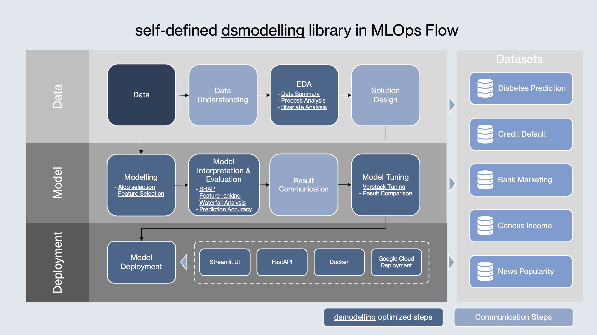

# Project Summary

## Highlights
1. **Standardized Data Science Workflow**: this project uses a self defined python library `dsmodelling` to streamline the data science workflow from data understanding, preprocessing, EDA to modelling, evaluation and deployment.
2. **Methodology**: this project applies a prudent and systematic approach to data analysis and model building, to ensure the model's reliability and robustness. It takes an cohort and forward prediction approach to model future customer churn behavior, and simulate real world deployment scenarios. It does not aim to achieve the best model performance, but to establish a solid foundation for future improvements and scalability.
3. **Parameter Tuning**: hyperparameter tuning is performed using `verstack`, a 2.3% improvement in AUC with 10-fold cross-validation is achieved.
4. **MLOps Approaches**: below are 4 key MLOps steps implemented in this project:
   * **Modularization**: use python library `dsmodelling` to modularize the key data science steps, from data EDA to model training and evaluation, then deployment (WIP).
   * **CI/CD**: version constrol using git and GitHub, separate development into 3 phases: development -> production -> documentation.
   * **Testing**: unit tests are implemented to ensure the production migration is consistent with the notebook outputs.
   * **Deployment**: simple model deployment using FastAPI, streamlit, and uvicorn (WIP).

## dsmodelling Library

The `dsmodelling` library is a self-defined python package to standardize and streamline the data science workflow. It provides the functions to cover key data science steps:
1. **Data Processing**: functions for one hot encoding to prepare data for modelling.
2. **EDA**: bivariate EDA framework to explore the association between each variable and outcome.
3. **Modelling**: wrapper functions for model training, algorithm selection, model interpretation, model individual case explanation, hyperparameter tuning
4. **Deployment**: simple deployment framework using FastAPI and uvicorn.

## Ideal Methodology for Similar Problems
1. **Crosectional Data**: if more data is available, a crosectional data collection approach should be use to capture customer behavior and future outcome status in a fixed time window. This approach can ensure to form a reliable foundation for estabilishing the association between customer behavior and outcome. 
2. **Matched Lookback Period**: to ensure the lookback period is matched between churned and non-churned customers, so that the time sensitive features can be properly engineered and interpreted, e.g. the top artists and song for specific time period.
3. **Fixed Lookfoard Period**: a fixed lookfoard period define the scope of future outcome prediction. For the same outcome in different length of lookfoard period, the incidence rate may vary significantly, thus the model robustness and performance may also vary. A proper lookfoard period should be defined based on the business requirement and data availability. In a proper data collection process, the lookfoard period determines how often the model should run to ensure the prediction is up-to-date.

## Methodology In This Project
1. **Data Preprocessing**: the data processing step focuses on preparing the data at the correct data resolution (user level). At this stage, we aim to add as much relevant features as possible, to capture the customer behavior from different angles, including persona, account info, activities/behavioral, preferences.
2. **Cohort Simulation**: to achieve a similar effect as crosectional data, we simulate a cohort based forward prediction approach. The key steps include:
   * **7 day lookback window**: to extract features from customer activity, and predict the churn status in "near future" not well defined yet due to data limitation
   * **Lookback Matching**: match the churn and retention customers in the same time period in the dataset
   * **Zero-activity Exclusion**: zero-activity customers from retention group are excluded from modelling, considering the look back window being short
3. **Association Exploration and Modelling**: the association between the lookback features and churn outcome are explored in both EDA and modelling stage. This approach aims to avoid data leakage which may result in siginificant performance drop in deployment stage.

## Limitations of the Current Approach
1. **Data Limitation**: the current dataset is limited in size and time span, which restricts the model's robustness and generalizability. 
2. **Lookfoard Period Ambiguity**: the lookfoard period is not well defined in the current dataset, which may lead to ambiguity in the model's prediction scope and performance interpretation.
3. **Potential Data Leakage**: as we simulated the cohort for analysis and modelling, the churn customer lookback period is exactly right before the churn event, which may introduce potential data leakage. The "close to churn" effect may be amplified for churn group, leading to over-optimistic model performance.

## Data Understanding

### Asset

 - **Notebook**: [Scripts/01_DataUnderstanding.ipynb](../Scripts/01_DataUnderstanding.ipynb)

 - **Report**: [Output/data_understanding/Report.html](../Output/data_understanding/Report.html)

### Key Findings
   - The dataset contains logs of user activities with timestamps, user IDs, session IDs, and event types.
   - The data has time range from 2018-10-01 to 2018-12-03.
   - The data are from 226 users, with a total of 277.4k records.
   - 52 users have "Cancellation Confirmation" events, indicating a churn rate of approximately 23%.
   - 7 / 52 users churned before 2018-10-08, which may not have enough data for training.
   - Identify 4 key questions to be clarified to ensure proper data understanding and feature engineering.

## Data Preprocessing & Feature Engineering

### Asset

 - **Notebook**: [Scripts/02_DataPreprocessing.ipynb](../Scripts/02_DataPreprocessing.ipynb)

 - **Output Data**: [Output/data_proc_eng/se_data_processed_pd.csv](../Output/data_proc_eng/se_data_processed_pd.csv)
 
### Data Resolution, Filter & Attributes
 - **Data Resolution**: user level, aggregated from event level data.
 - **Data Filter**:
   - Exclude users with no userId
   - Exclude users who churned before 2018-10-08, not enough data before churn event.
   - Random sample to match the lookback period of non-churned users to churn customer
   - Exclude customers without activity in the 7 days lookback period.
   - Final dataset contains 163 users, 45 churned and 118 non-churned, churn rate approximately 27.6%.
 - **Label**
   * Churn
 - **persona**
   * Gender
   * Location

 - **Account**
   * Since Registration
   * Paid Category

 - **Activities / Behavioral**
   * Page event counts
   * Session event counts

 - **Preferences**
   * Song stats
   * Artist stats

## Exploratory Data Analysis (EDA) & Modelling
### Asset

 - **Notebook**: [Scripts/03_EDAModelling.ipynb](../Scripts/03_EDAModelling.ipynb)

 - **Report**: [Output/EDA/Summary/DataSummary.html](../Output/EDA/Summary/DataSummary.html)

 - **Modelling Report**: [Scripts/html/03_EDAModelling.html](../Scripts/html/03_EDAModelling.html)

### Key Findings
- **EDA**: A systematic bivariate EDA framework are applied to key variables to identify the association between each variable and churn status, this bivariate analysis reveals that:
    1) **association**: the churn rate of customers segmented by the value of the variable
    2) **distribution & impact**: the distribution of the variable which can interpret the impact of this segment on overall variable effect on churn
- **Modelling approach**: the modelling approachy is cohort based forward prediction. This approach aims to:
    1) simulate a 7 day look back window to extract features from customer activity, and predict the churn status in "near future" not well defined yet due to data limitation
    2) match the churn and retention customers in the same time period in the dataset
    3) zero-activity customers from retention group are excluded from modelling, considering the look back window being short
- **LightGBM model** is used as the base model, though it is not the best performing model in this limited data setting, it will reveal its strength over other models when dealing with larger datasets
- **Hyperparameter tuning** is performed using verstack, a 2.3% improvement in AUC with 10-fold cross-validation is achieved.

